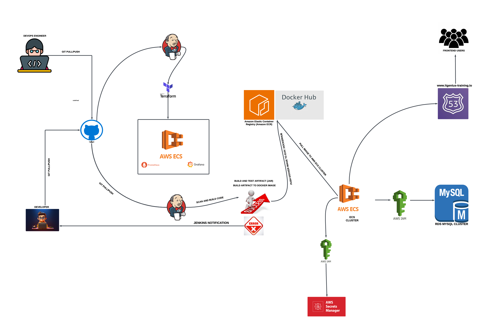

# ITGenius CI/CD Pipeline – Containerized Deployment to AWS ECS

This repository documents a modern CI/CD pipeline for deploying the ITGenius application as a containerized service to AWS Elastic Container Service (ECS). The pipeline automates source code integration, testing, image building, artifact management, infrastructure provisioning, and production deployment. All services are integrated using AWS-native and open-source DevOps tools.

---

## Architecture Diagram

---

## Overview of Workflow

### 1. Developer Workflow

- Developers push/pull code to/from GitHub using standard Git commands.
- Changes to the codebase trigger the Jenkins pipeline automatically.

### 2. Continuous Integration and Testing (Jenkins)

- Jenkins pulls the latest code from GitHub.
- Jenkins scans the code, runs unit tests, and builds the Java `.jar` artifact.
- The artifact is containerized into a Docker image.
- If tests fail, Jenkins sends error notifications to the development team.

### 3. Artifact Management

- The Docker image is tagged and pushed to Amazon Elastic Container Registry (ECR) and Docker Hub.
- Only successfully built images are deployed to ECS.

### 4. Infrastructure Provisioning

- Infrastructure is provisioned using **Terraform** (IaC) to ensure repeatability and scalability.
- ECS clusters and related resources are defined declaratively.

### 5. Deployment to AWS ECS

- Jenkins pulls the latest Docker image from ECR.
- The image is deployed to an ECS Cluster.
- AWS Secrets Manager injects necessary credentials securely into the running containers via IAM roles.

### 6. Database Integration

- The ECS-based application connects to an **Amazon RDS MySQL Cluster** using **IAM authentication** for secure access.

### 7. Frontend Access

- The application is accessible to end-users through a DNS record configured in **Amazon Route 53**: `www.itgenius-training.io`.

### 8. Monitoring and Observability

- Application health and metrics are monitored using **Prometheus** and **Grafana** integrated within the ECS environment.

---

## Tools and Technologies

| Category               | Tools/Services Used                    |
| ---------------------- | -------------------------------------- |
| **Version Control**    | GitHub                                 |
| **CI/CD**              | Jenkins                                |
| **Containerization**   | Docker, Amazon ECR, Docker Hub         |
| **Infrastructure**     | Terraform                              |
| **Secrets Management** | AWS Secrets Manager, IAM               |
| **Database**           | Amazon RDS (MySQL), IAM authentication |
| **Monitoring**         | Prometheus, Grafana                    |
| **DNS & Access**       | AWS Route 53                           |

---

## Getting Started

To replicate this same setup:

1. Clone it locally and make it yours.
2. Follow the setup instructions on our Confluence documentation page:  
[View Setup Guide](https://itgenius-team-u5ijt9rh.atlassian.net/wiki/spaces/documentat/folder/82247700?atlOrigin=eyJpIjoiMjg1NDc0NzViOGM0NDcwZDhkM2U3ZTM3MjBlOGM2MDgiLCJwIjoiYyJ9)

Deploy to your own AWS environment or development cluster.

---

## Notes

- Ensure IAM roles are properly scoped to restrict resource access.
- Jenkins credentials and secret keys should be managed securely using AWS Secrets Manager or environment variables.
- Monitoring dashboards should be customized in Grafana to match service-level indicators (SLIs).

---
